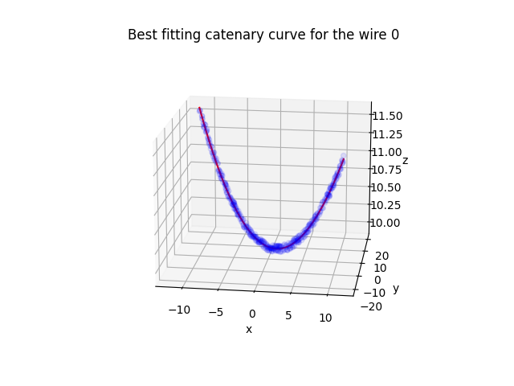

# WireModeling

### Introduction

In this package we implements few methods to analyse a set of points representing electric wires, and make a modelisation of each wire using catenary curves.

To do this, we implement several classes -- a class Point, a class Cloud, a class Clusters, a class _3D_CatenaryCurve and a class Model -- that enable us to store the data, make a satisfying clustering of the points, find out the horizontal axis corresponding to the horizontal projection of the wire and search for the best-fitting catenary curves which gives the height of a point from its horizontal position.

### 1) First classes and clustering

After creating classes to represent each point and the set of points, we implement the clustering with the Clusters class.
At first, the DBSCAN algorithm seemed to be fitted for the problem, and with well-choosen parameters (the maximum distance allowed between a point and its cluster and the minimum size of sample to allow a group of points to be a cluster), it worked perfectly for the easy dataset.

Yet it could not work with the other data set, with problems such as a low density of point despite the wires being near to each other, which led to unsatisfying clusters.

Since each of the wires is roughly contained in a plane (generated by an horizontal axis and a vertical one), I decided to realize a projection of the points on the horizontal vector normal to this plane.

The wires being parallels, we use a linear regression on the whole set of point (even if not always exact, the axis z corresponds **approximately** to the vertical axis), to get the relation between the coordinates of axes x and y. We can then choose the horizontal axis which minimises the fluctuation of the point.

By projecting the points on this axis, we can then realize a clustering in one dimension (still with a DBSCAN algorithm) that is entirely satisfying for a set of parameters identical for all the data set.
For the second data set however, two groups of wires are placed the ones above the others ; we thus realize a first approximate clustering (with less restrictive parameters) to separate the groups of wire.

We then have our two-parts clustering method (with possibility for the users to change the parameters used for the DBSCAN algorithm, the default parameters woking for every data set).

### 2) Best-fitting planes

Once we have the clusters, the class Cluster and the class Model manage the search of best-fitting planes (using again a linear regression).

We suppose that the z axis is approximately the vertical one, but if the correlation between the z coordinates and the coordinates on the normal "horizontal" vector, we rectify the vertical vector and the horizontal one to be closer to compensate.

We have then planes and vertical axes adapted for each cluster.

### 3) Catenary curves

At last, the _3D_CatenaryCurve and the Model classes enable us to project the points of each cluster on the 2D-planes adapted, and to find the parameters $x_0$, $y_0$ and $c$ associated with the best-fitting catenary function $f : x \longmapsto y_0+c*(cosh(\displaystyle{\frac{x-x_0}{c}})-1)$.

The _3D_CatenaryCurve class contains every information about a wire ; it spatial extension, the vertical and horizontal axes associated, and the parameters of the catenary function.

The Model class also enables to display 2D and 3D-plots of the different wires and their modelisation, such as showed below.

Best-fitting catenary curve and the cluster associated for a wire from fourth data set

Best-fitting catenary curve and the cluster associated for a wire from second data set
